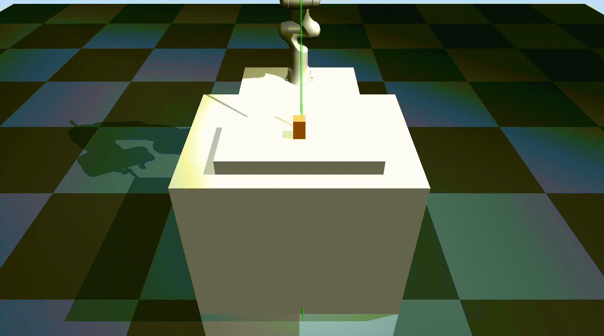
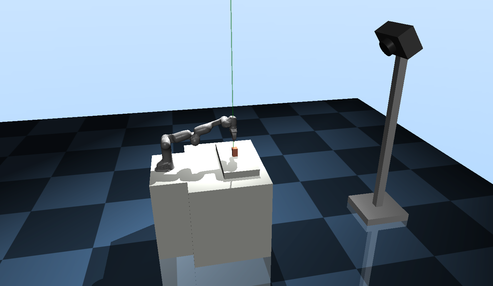

# Simple-MuJoCo-PickNPlace



Very simple MuJoCo Pick and Place task using Panda robot

Get grasp pose by solving IK in MuJoCo, and Control to that using PID control

IK module, MuJoCo Panda environment, PID controller code is fully based on [yet-another-mujoco-tutorial](https://github.com/sjchoi86/yet-another-mujoco-tutorial)

## Installation
```
$ git clone https://github.com/volunt4s/Simple-MuJoCo-PickNPlace
$ cd Simple-MuJoCo-PickNPlace
$ pip install -r reqirements.txt
```

## Dependencies
- mujoco
- mujoco-python-viewer

## How to run?
```
$ python pnp.py
```

## Detail
Rendering process is run on fixed camera. Environment picture below.


Task sequence below

1. pre_grasp
     - Initialize grasp pose
2. rotate_eef_i0
     - Slightly rotate end effector about z-axis
3. move_down_1
     - To grasp object, move end effector to top of object
4. grasp
     - Gripper close
5. pre_grasp_with_close
     - Move to pre_grasp pose with gripper closed
6. rotate_eef_i1_with_close
     - Slightly rotate end effector about z-axis with gripper closed (next pose of rotate_eef_i0)
7. move_down_2_with_close
     - Move end effector to release height (slightly upper than move_down_1 due to control error)
8. release
     - Gripper open 
- Go to 1. and repeat

## Acknowlegement
Thanks to [sjchoi86](https://github.com/sjchoi86) for his brilliant MuJoCo environment setup and implementation